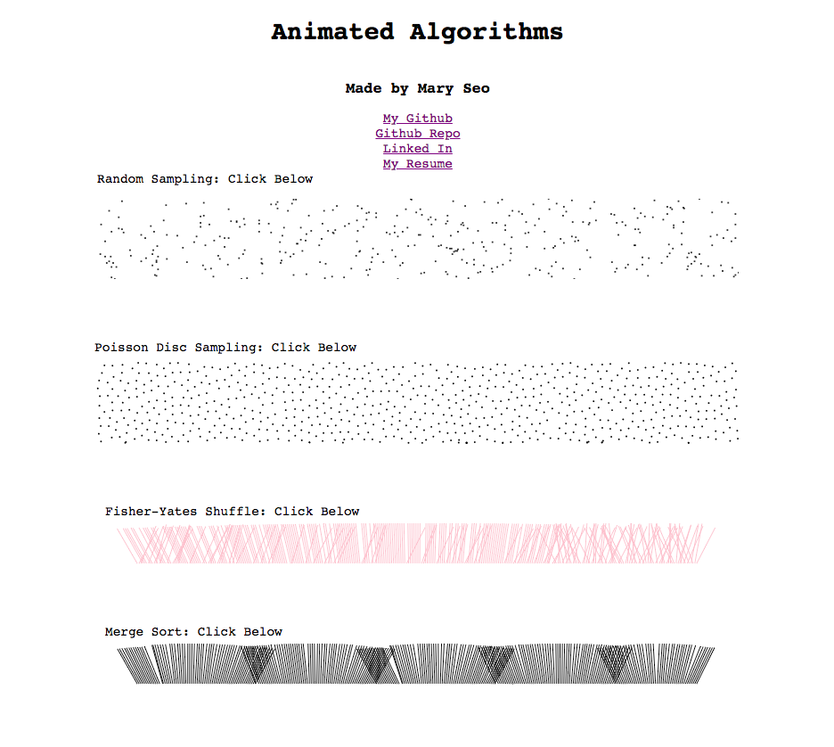

# Algorithm-Visualizations
Live: http://maryseo.net/Algorithm-Visualizations/
### Background
- Poisson-Disc Sampling vs. Random Sampling
  - Poisson-Disc: Candidates are chosen from a sampling area. The best candidate is the one that is farthest away from all previous samples. After candidates are created and distances measured, the best candidate becomes the new sample. Remaining candidates are discarded.
  - Uniform Random Sampling: results in severe under and oversampling where many samples are densely overpacked or overlapping.
- Fisher–Yates Shuffle and Merge Sort
  - The Fisher-Yates Shuffle algorithm runs in linear time and uses constant space. It splits an array into two parts, the right (shuffled) and left (unshuffled) sides. Step by step, the algorithm randomly picks an element from the left and moves it to the right.
  - Merge Sort: takes in an array of shuffled arrays and bottom-up merges elements, sorts them, and then merges again.


### Functionality and MVP's
1. Poisson-Disc Algorithm
2. Fisher-Yates Shuffling Algorithm
3. Merge Sort, Random Sampling
4. Using D3 to animate changes in candidates




### Architecture and Technologies
- d3
- JavaScript
- Canvas

### Implementation Timeline
Day 1: Poisson-Disc and Random Sampling (using same default settings for rendering generation of dots)

Day 2: Fisher-Yates and Merge Sort (using the same default settings for rendering lines as shuffled/unshuffled)

Day 3: Merge Sort

Day 4: Random Traversal visualization

### Using d3 and Canvas
- The Poisson Disc Sampling visualization utilizes d3's timer method that, through currying, continues to call the draw() function until it fills the SVG element.
```
 d3.timer(function () {
    for (let i = 0; i < 5; i++) {

      var s = start();
      if (!s) return true;
      svgSelection.append("circle")
      .attr("cx", s[0])
      .attr("cy", s[1])
      .attr("r", 1)
      .style("fill", "black")
    }
  });
  ```

- Bottom-up, non-recursive Merge Sort
```
function mergesort(array) {
    let sorted = [],
        size,
        j,
        m = 1;

    while (m < array.length) {
      size = j = 0;
      while (size < array.length) {
        j += merge(size, size += m, size += m);
      }
      if (j) sorted.push(array.slice());
      else m *= 2;
    }

    function merge(start, middle, end) {
      middle = Math.min(array.length - 1, middle);
      end = Math.min(array.length - 1, end);
      for (; start < middle; start++) {
        if (array[start] > array[middle]) { //i.e., if array[0] > array[1]
          let v = array[start]; //set v = array[0]
          array[start] = array[middle]; //set array[0] = array[1]
          insert(middle, end, v); //insert v into array[0]'s position
          return true;
        }
      }
      return false;
    }

    function insert(startIdx, endIdx, target) {
      while (startIdx + 1 < endIdx && array[startIdx + 1] < target) {
        let temp = array[startIdx];
        array[startIdx] = array[startIdx + 1];
        array[startIdx + 1] = temp;
        startIdx++;
      }
      array[startIdx] = target;
    }
    return sorted;
  }
```
